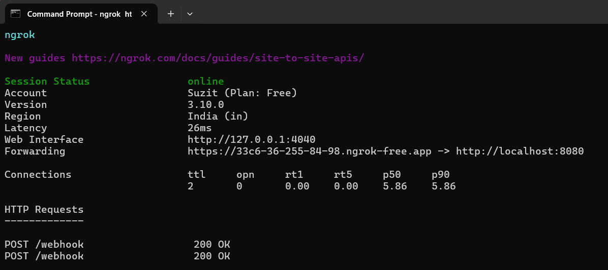
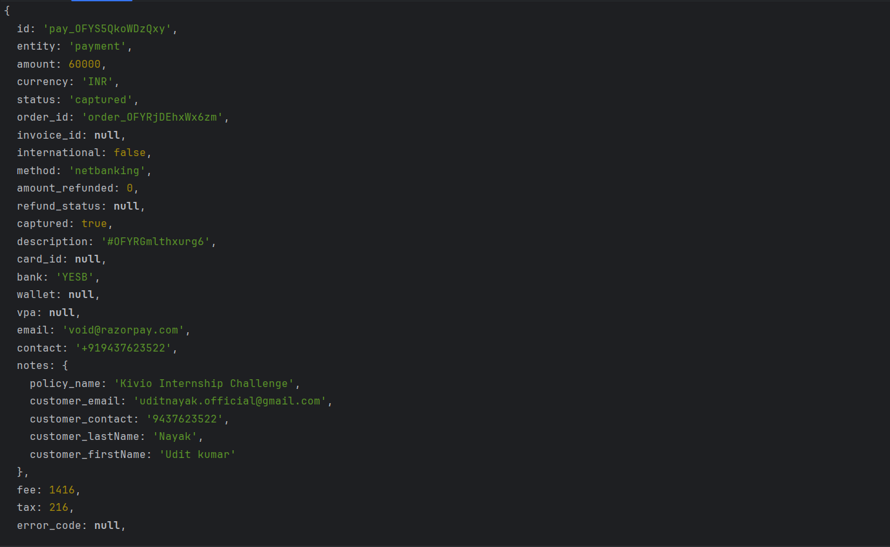

# 1. Backend Integration with Razorpay and Zoho CRM

This project implements a backend system that handles payments via Razorpay, captures payment details through a webhook, and stores the details as leads in Zoho CRM. The backend is built using Node.js and Express.js.

## Table of Contents
- [Workflow](#workflow)
- [Features](#features)
- [Installation](#installation)
- [Configuration](#configuration)
- [Usage](#usage)
- [API Endpoints](#api-endpoints)
- [Demo Images](#demo-images)
- [References](#references)

## Workflow


## Features
- Generate Razorpay payment links.
- Capture payment details via Razorpay webhooks.
- Store payment details as leads in Zoho CRM.

## Installation
1. Clone the repository:
    ```bash
    git clone https://github.com/yourusername/yourrepository.git
    ```
2. Navigate to the project directory:
    ```bash
    cd yourrepository
    ```
3. Install dependencies:
    ```bash
    npm install
    ```

## Configuration
1. Create a `.env` file in the root directory and add the following environment variables:
    ```
    RAZORPAY_ID = { Enter Your Razorpay key id }
    RAZORPAY_SECRET = { Enter Your Razorpay key secret }
    WEBHOOK_SECRET = { Enter Your Razorpay Webhook Password }
    ZOHO_CLIENT_ID = { Enter Your ZOHO client id }
    ZOHO_CLIENT_SECRET = { Enter Your ZOHO client secret }
    ZOHO_REFRESH_TOKEN = { Enter Your ZOHO Refresh Token }
    ```
   
2. I had used ngrok to expose my local server to the internet. You can use it to expose your local server to the internet. 
    ```bash
    ngrok http 8080
    ```
    Copy the forwarding URL and add it to the Razorpay webhook URL.


## Usage
1. Start the server:
    ```bash
    npm start
    ```
2. The server will run on port 8080 by default.


## API Endpoints

### Create Payment Link
- **URL:** `/payment`
- **Method:** `POST`
- **Description:** Generate a Razorpay payment link.
- **Request Body:**
    ```json
    {
      "amount": 400,
      "currency": "INR",
      "firstName": "Udit kumar",
      "lastName": "Nayak",
      "email": "uditnayak.official@gmail.com",
      "phone": "9999999999"
    }
    ```
- **Response:**
    ```json
    {
      "paymentLink": "https://rzp.io/i/abcdef"
    }
    ```

### Webhook Endpoint
- **URL:** `/webhook`
- **Method:** `POST`
- **Description:** Capture Razorpay payment details and store them as leads in Zoho CRM.
- **Request Body:** The request body is received from Razorpay's webhook.

## Demo images


### Payment Link Generation


###### Payment request received in gmail and Text message


### Webhook Received


### Webhook Dashboard


### Lead Creation in Zoho CRM


# 2. Conversational AI Avatar : Bonus Task

## Workflow


## Features [ Planned ]
- Text + Voice input
- Video Output
- Live Captions

## Features [ Implemented ]
- Voice input
- Text Output

## Future Scope
- Video Output
- Live Captions
- Low Latency by using better models
- Better UI
- More Customization
- More Languages
